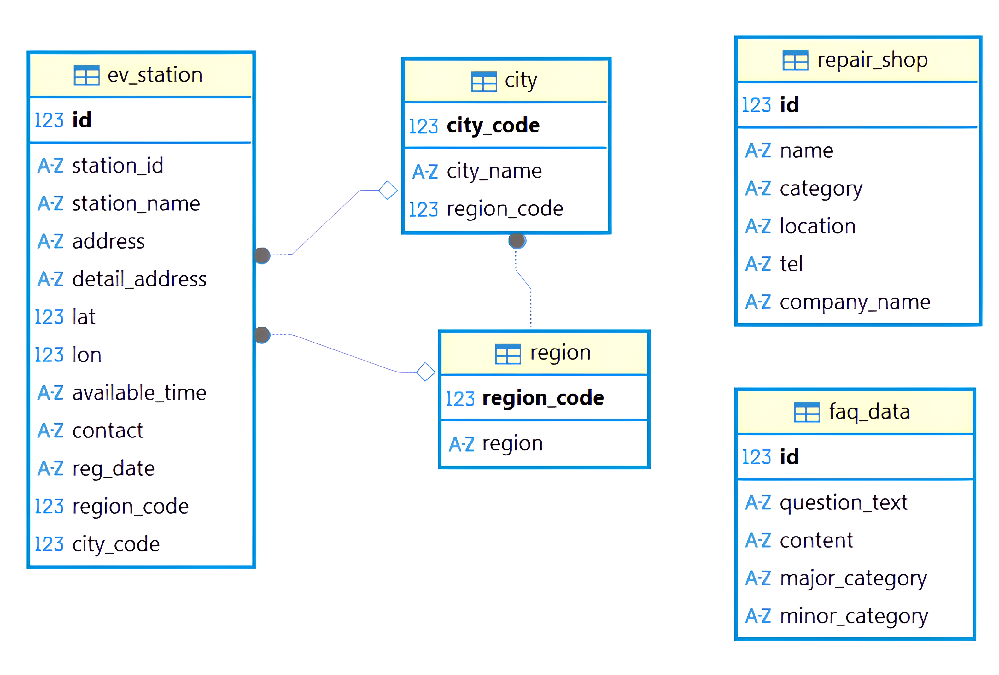

# ⚡지역별 EV 충전소 & 정비소 & FAQ 통합 서비스⚡

## 1. 📋 프로젝트 소개
### 😊 프로젝트 팀원 및 역할

| 이름 | 역할 | Git |
| :--- | :--- | :--- |
| 유헌상 (팀장) | 데이터 총괄 및 streamlit 메인페이지 구현 |   |
| 김다빈 (팀원) | 현대 faq, 웹사이트 크롤링 담당, streamlit faq페이지 구현 |   |
| 김민정 (팀원) | Mysql 데이터 정제 및 streamlit 정비소 페이지 구현 | [Git](https://github.com/skn23-kmj)|
  
## 📅 프로젝트 기간 
```
2025.12.10(수) ~ 2025.12.11(목)
```
## 2. 🎯프로젝트 개요 및 소개
### ✔️ 배경
전 세계적인 **기후 변화와 지구 온난화** 문제로 인해, 전기차(EV)에 대한 관심과 수요가 급증하고 있습니다.<br>
이에 따라 전기차 운전자들은 편리하고 정확한 충전소 및 정비소 정보에 대한 필요성이 더욱 커지고 있습니다.
### ✔️ 목표
**전기차 운전자** 및 **예비 구매자**를 대상으로, 현시점 및 선택 지역을 기준으로 가장 가깝고 적합한 충전소 및 정비소 정보를 제공하여 **효율적인 EV 라이프**를 지원하는 것을 목표로 합니다.

### ✨ 주요 기능 및 특징

본 서비스는 전기차 운전자의 편의성 향상을 위한 핵심 기능을 제공합니다.

* **통합 검색 기능:** 전국 EV 충전소 및 정비소 정보를 한 번에 검색합니다.
* **지역별 위치 조회:** 시/도와 시/군/구 기반의 2단계 필터링을 통해 원하는 지역의 충전소를 정확하게 조회합니다.
* **주소 기반 상세 검색:** 주소 또는 충전소/정비소명을 기반으로 상세 검색을 지원합니다.
* **FAQ (자주 묻는 질문) 기능:** 전기차 이용 및 서비스 관련 자주 묻는 질문과 답변을 제공합니다.
* **Streamlit 인터랙티브 UI:** 사용자 친화적인 Streamlit 기반의 대화형(인터랙티브) 사용자 환경을 제공합니다.


## 3. 🛠️ Tech Stack

🔧 Backend : 
`Python`
`Data`
`Pandas`
`MySQL`
`Selenium`

🎨 Frontend : 
`Streamlit`
`CSS`
`SessionState`

🧰 Tools : 
`Co-Work Tools`
`Git / GitHub`
`Notion`


## 4. 📈 데이터베이스(ERD)
 


## 5. 🖥️ 결과 화면
이미지/영상 추가

## 6. 📂 디렉토리 구조
```
📁skteam2
└── 📁1st_team3
    └── 📁project
        ├── 📁api
        │   ├── 📄__init__.py
        │   ├── 📄car_typy.py
        │   ├── 📄station.py
        │   └── 📄total_car.py
        ├── 📁crawling
        │   ├── 📄bluehands.py
        │   ├── 📄chromedriver.exe
        │   ├── 📄faq_crawling.py
        │   ├── 📄faq_data.sql
        │   ├── 📄faq_output.csv
        │   ├── 📄faq_output.json
        │   ├── 📄kiaautoq.py
        │   ├── 📄link_sql.py
        │   └── 📄tesla.py
        ├── 📁pages                    # streamlit FAQ 페이지
        │   ├── 📄faq.py               # streamlit 지역별 정비소 찾기 페이지
        │   └── 📄repair.py
        ├── 📁utils
        │   ├── 📄__init__.py
        │   ├── 📄insert_cartype.py
        │   ├── 📄insert_stations.py
        │   └── 📄insert_totalcar.py
        ├── 📄__init__.py
        └── 📄main.py
```
## 7. 🚀 실행 방법
파이썬먼저 까세요~

## 8. 🔄 향후 개선 사항
- FAQ CRUD 기능 추가
    - 사용자들이 자주 묻는 질문을 직접 등록·수정·삭제할 수 있도록 기능 확장
- 사용자 로그인/회원관리 기능
    - 개인화된 서비스 제공을 위한 기본 인증 시스템 구축
- 반응형 UI 적용
    - 모바일/태블릿에서도 최적화된 화면 제공
- 관리자 페이지 구축
    - 충전소·정비소·FAQ 등 전체 데이터 관리 기능 제공
- API 기반 실시간 충전소 정보 연동
    - 실제 충전 가능 여부 및 상태를 실시간으로 표시
- 정비소 위치 연동 및 지도 표시 기능 강화
    - 위치 기반 필터링 및 UX 향상
- 추가 브랜드/타사 크롤링 데이터 확대
    - 더 다양한 정비소·충전소 데이터 확보
- 카카오맵 마커 고도화
    - 충전소/정비소 종류별 아이콘 및 마커 UI 개선


## 💬 한줄 회고
- 유헌상
- 김다빈
- 김민정
    ```
    팀장님 readme 확인해주세요오오
    ```